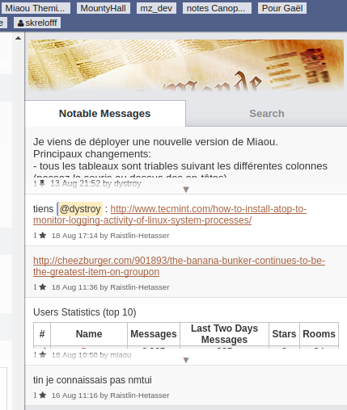
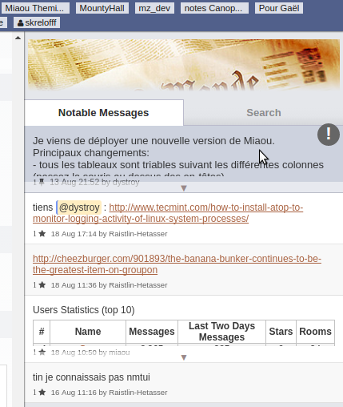
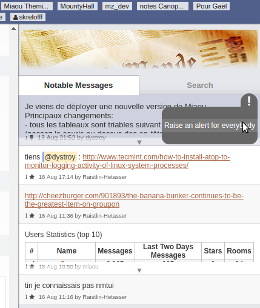
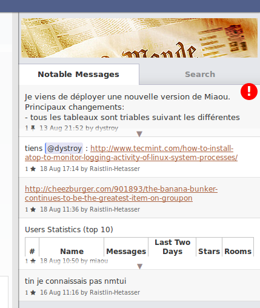
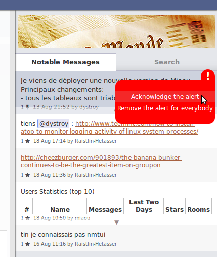
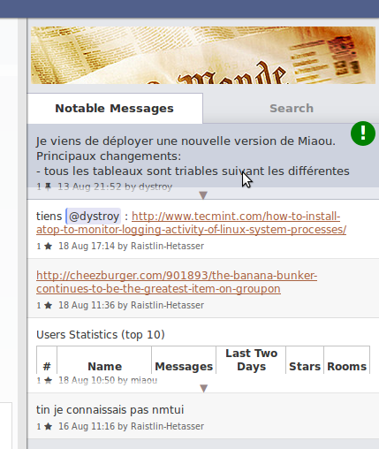

The "attention" plugin makes it possible for admins of a room to get the attention of everybody to a pinned message.

## Usage

The right area displaying starred and pinned messages normally looks like this:

When a room admin hovers the message, an exclamation icon shows the feature is available. It's grey here because no attention has been brought to that message.

Moving the mouse to the exclamation icon reveals a menu:

Raising the alert makes the icon red and visible for all other users:

The menu for those users make it possible to acknowledge the alert. In this specific case the user's also an admin and can thus remove the alert for everybody:

Once acknowledged, the icon turns green and is only visible when hovering the message:

## Limits

Alerts can't currently be raised or displayed on the mobile version of the Miaou GUI.

