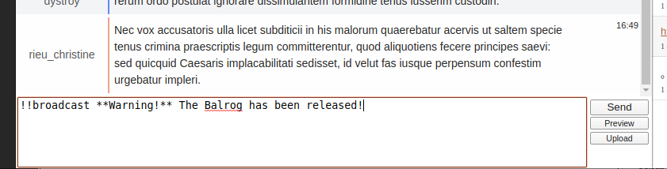
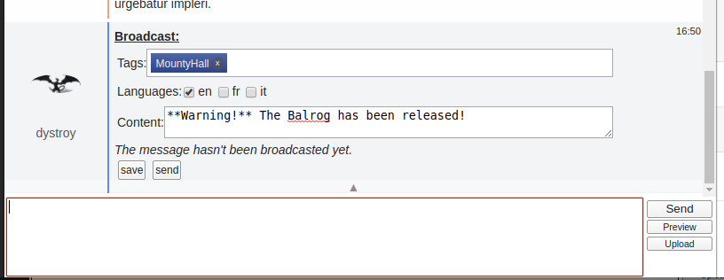
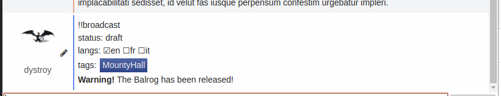
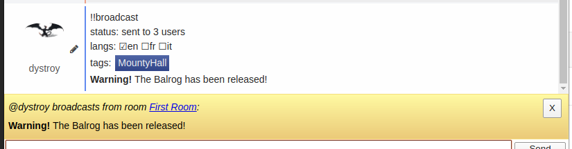

This plugin lets server admin send a flash non persisted message to all rooms.

The most obvious use case is to alert everybody about a server wide event.

## Usage

The user wanting to send a message type the `!!broadcast` command followed by the text to dispatch:

The message is then displayed with specific widgets to tune the languages and tags:

Hitting the "save" button might be useful to get approval of other users of the rooms.
They see the message in preparation in a read only form:

Hitting the "send" button broadcasts the message to all intended connected users:

## Broadcasting Rules

The notification is displayed for any user who is directly or via a watch in a room whose language was checked and having one of the specified tags.

If no tag was specified, the tags of the rooms don't matter.

User don't have to be in the matching rooms, they may be notified as soon as they have a matching room in their watches.

But a user who isn't connected at broadcasting time won't be notified.

## Settings

This command is only available to server admins. They're defined in the [config file](../config-default.js).

In the following example, two server admins are defined, one by name and one by id:

	"serverAdmins": ["dystroy", 3],

