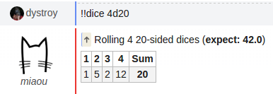

The `dices` plugin simulates throwing dices with an arbitrary number of sides, such as the ones of Role Playing Games.

## Usage

    !!dice <number of dices>d<number of sides>

Both a specific set of dice throws and and the expected mean are computed.

## Example

