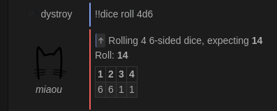
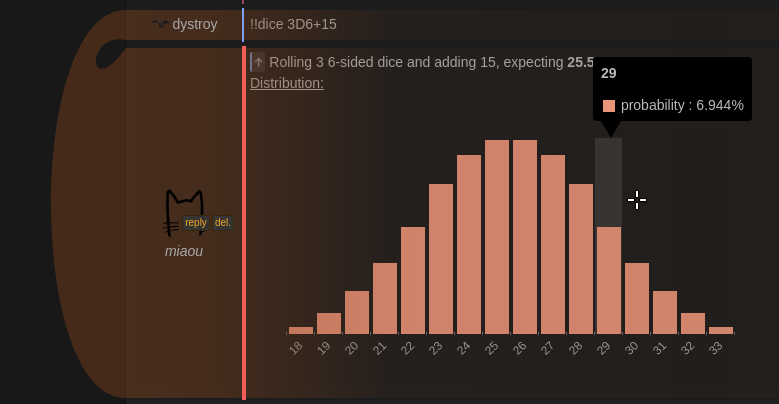
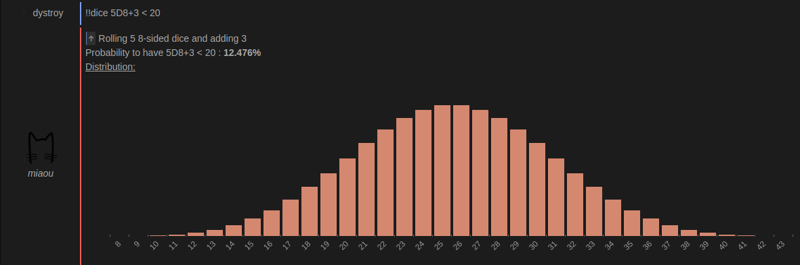
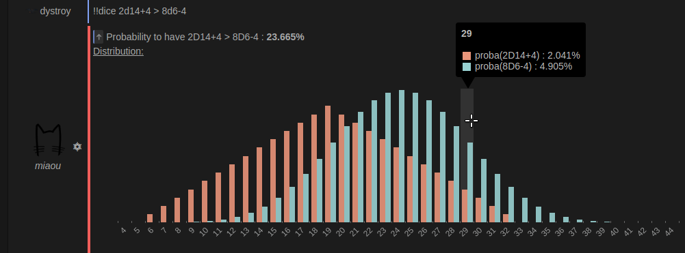

The `dices` plugin simulates throwing dices with an arbitrary number of sides, such as the ones of Role Playing Games.

It lets you

* roll the dice (for example toss heads or tails in the chat)
* study the various probabilities related to some dice rollings

*Dice Roll Definitions* are written as

    <number of dice> D <number of sides> + <added constant>

### Just roll some dice

Simply use the `roll` option:

### See distribution

Use `!!dice dist` or just `!!dice`:

### Estimate the probability to reach a threshold or fall on a given value

### Compare two distributions

