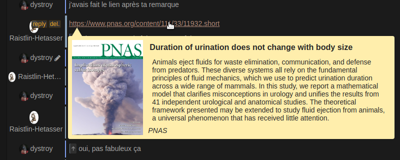

This plugin adds "preview" bubbles on external links.

The displayed information is from Open Graph meta tags when available, or from lesser standardized tags otherwise.

The query is done server side, to bypass CORS limitations, and the content is cached both sides.
