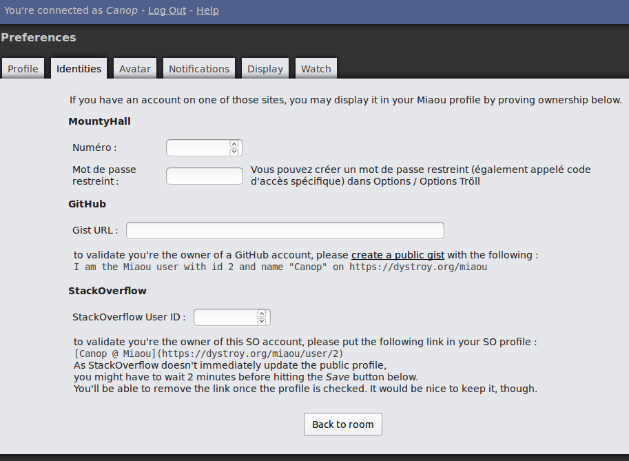
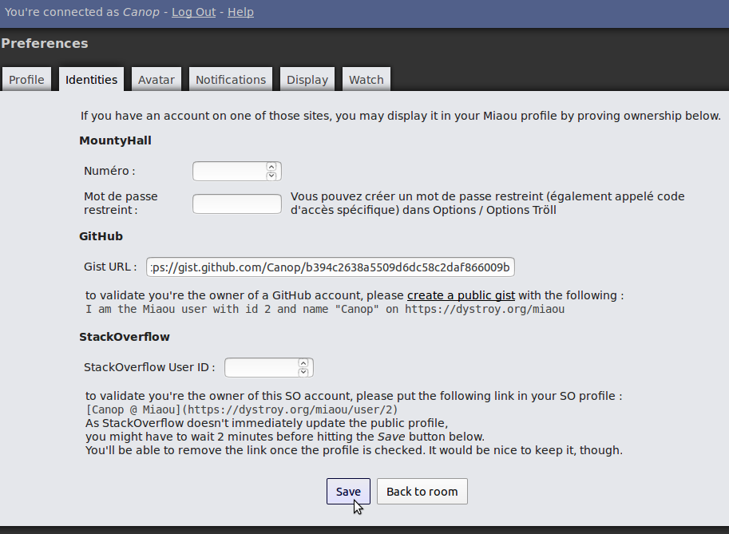

This plugin lets users display a proven GitHub identity in their Miaou profile, by asking them to create a specific personal gist using their GitHub account.

## Usage

The `Identities` tab of the Settings displays all available external identity proving modules, with the relevant explanations. In the case of GitHub, the user is asked to create a public gist with a given sentence:

The user must paste the gist's URL then click <kbd>save</kbd>:

Once it's done, its GitHub identity can be checked by everybody in the chat:

