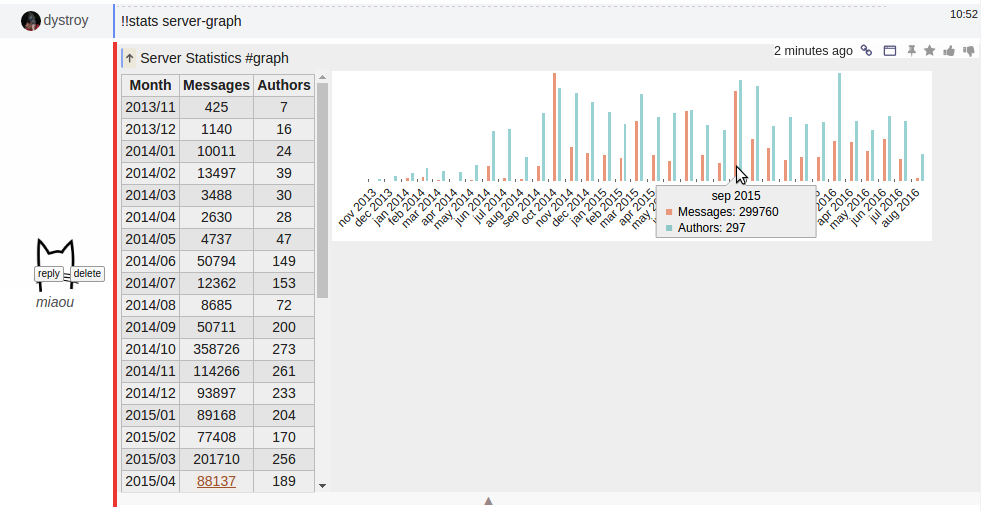

This client-side only plugin introduces a rendering pragma, `#graph`, which instructs the browser to automatically add an interactive SVG graph using the first found data table.

## Usage

The first table of the message is interpreted. Its first column must contain dates or integers with increasing values. It will be used as X data set. One or several following columns may be interpreted as Y values.

Tables not matching those requirements aren't rendered.

### Exemple 1

The following message contains the `#graph` pragma and a markdown table:

	#graph
	stuff | amount | speed
	:-:|:-:|:-:
	1 | 53 | 450
	2 | 85 | 587
	3 | 21 | 653

It's rendered like this:

Hovering the bars show the values:

### Exemple 2

The `!!stats server-graph` command produces a message with the `#graph` pragma, so that the table is rendered as a graph, where the X values are months:

## Limits

This plugin is very crude right now. The only available data interpretations are the ones for which there was an obvious use in Miaou.

Interested users are encouraged to require more features and to present their use cases.
