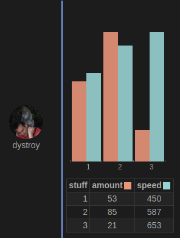
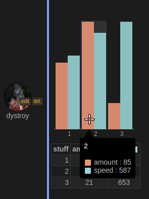

This client-side plugin introduces a rendering pragma, `#graph`, which instructs the browser to automatically add an interactive SVG graph using the first found data table.

The server side part offers a facility to generate the pragma.

## Usage

Its first column will be used as X data set. Some automatic interpretation (for exemple dates) may occur to improve the result's formatting.

One or several following columns may be interpreted as Y values.

Tables not matching those requirements aren't rendered.

## Exemple

The following message contains the `#graph` pragma and a markdown table:

	#graph
	stuff | amount | speed
	-:|:-:|:-:
	1 | 53 | 450
	2 | 85 | 587
	3 | 21 | 653

It's rendered like this:

Hovering the bars show the values:

## Options

Rendering options can be provided in the #pragma graph the following way:

	#pragma(option1,option2,option3)

To see the options on rendered graphs, simply hover the line before the graph to reveal it.

Note: While a pragma can be written by hand, or composed by concatenating strings, it's recommanded
for plugins to use the `pragma` function of the lib as the format isn't yet guaranteed to stay unchanged.

For example the message produced by the `!!stats graph @dystroy @Shaks` command contains the following pragma:

	#graph(hideTable,compare,sum)

If the `hideTable` option weren't included, the user would see the following table:

And here's the rendered result:

(You might notice that the X column values are interpreted as dates for an improved formatting)

### hideTable option

This option hides the data table (it's not removed from the message and could be seen in the console, the intent of the option is to unclutter the message).

### compare option

This tells the grapher that all value columns should be rendered with the same Y ratio, instead of applying a normalization per column.

This should be used when the data are the same dimension and must be compared.

### sum option

This adds a curb displaying the accumulated value.

If only some column(s) must be displayed, then their (zero-based) index must be specified, for example `sum2` to add a summing curb for the third column of values.

### highligh-x option

This makes it possible to have some X values highlighted.

For example the `!!stats hours` command produces the following graph:

The current hour is highlighted using this pragma:

	#graph(hideTable,highlight-x:18h)

### Columns selection

Columns are normally automatically selected but you might want to override this behavior by using the `xcol` and/or `ycols` options and passing the relevant 0-based indexes.

For example:

	#graph(xcol: 1, ycols: 2 3)
