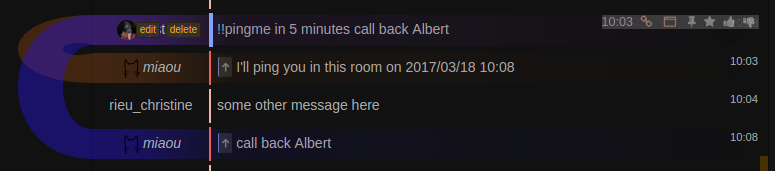
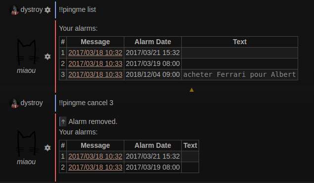

The `!!pingme` command lets user program a bot ping in the room, in the near or distant future.

Alarms are persisted in database and they're guaranteed to run.

The ping is made as an answer to the command message, making it easier for the user to find the context.

## Example

## Usage

The commands takes as parameters

* when the ping must be thrown
* an optional text to display with the ping

The command is versatile enough to accept several ways to set the date:

	!!pingme 14h25 meeting
	!!pingme tomorrow 22h
	!!pingme 00h15 rendez-vous synchro
	!!pingme in 3 hours and 24 minutes
	!!pingme in 3 hours
	!!pingme meeting at 23h at the pub
	!!pingme at 3h
	!!pingme in 5 minutes back to work
	!!pingme 2025/02/23 4h05
	!!pingme 2019/03/11 6h Christine's birthday

It's also possible to list all programed alarms and to cancel one:

