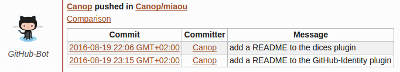

The `!!github` command lets you manage registrations to GitHub repositories. When a room registers for a repository, the GitHub bot alerts in case of issues, commits, and comments.

The complete procedure and list of sub commands is detailed when you type

    !!github help

The scm-hook plugin runs the `!!github` command but is also a framework for similar commands for other scm providers.
