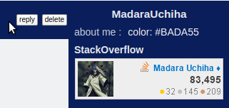
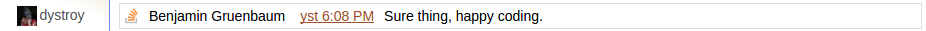
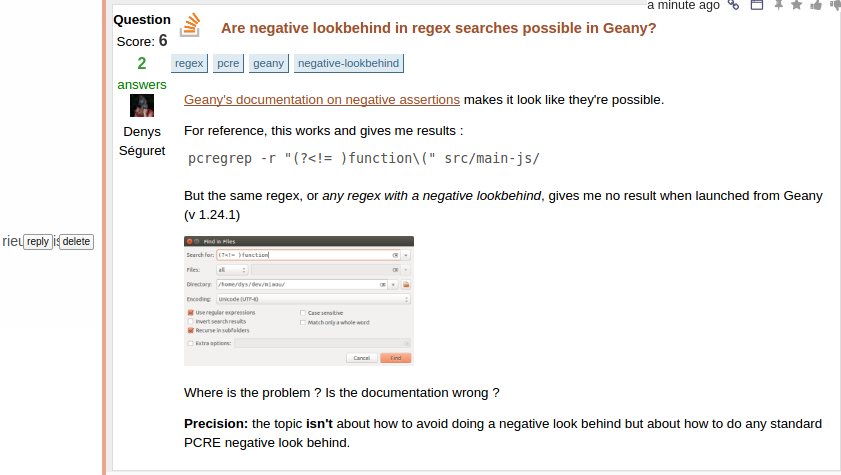
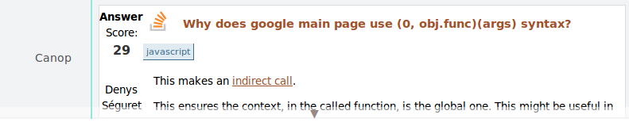

The stackoverflow plugin groups several features.

## StackOverflow identity proving and display in the Miaou profile

Account ownership proving works by requiring the user to include a specific (temporary) text in his StackOverflow profile.

## StackOverflow chat message boxing

A link towards a StackOverflow chat comment, when alone on its line in a Miaou message, will be boxed.

For example this message:

	http://chat.stackoverflow.com/transcript/message/32410210#32410210

is rendered as:

## StackExchange question or answer boxing

Not all SE sites are covered, but the ones matching `https?:\/\/(meta\.)?(stackoverflow|askubuntu|([^.]+\.)?stackexchange|superuser|serverfault).com`.

### Exemple of question

#### Message:

	https://stackoverflow.com/questions/29033499/are-negative-lookbehind-in-regex-searches-possible-in-geany

#### Rendered:

Note that the related comments and answers aren't included in the boxing. To see them the user will have to click the link which brings to the question's page on the site.

### Exemple of answer

#### Message:

	http://stackoverflow.com/a/19535819/263525

#### Rendered (not open):

