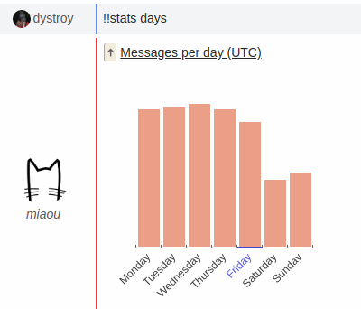

The !!stats command, with its many options, provide various statistical informations about the Miaou instance.

### General Use

The default command mostly gives global counts:

`!!help !!stats` lists many variations, and the auto-completion of aguments guides into composing a command.

There are more possibilies than what can be shown here so the rest of this README will only display a few significative examples.

### Evolution of messages and authors

### Rooms and Users

### Frequentation Histograms

### Miscelaneous

