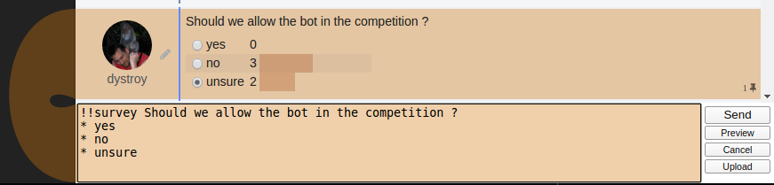

This plugin introduces the `!!survey` command which changes messages containing lists into survey where every user can vote once.

A new table is automatically created for this plugin, storing user votes.
