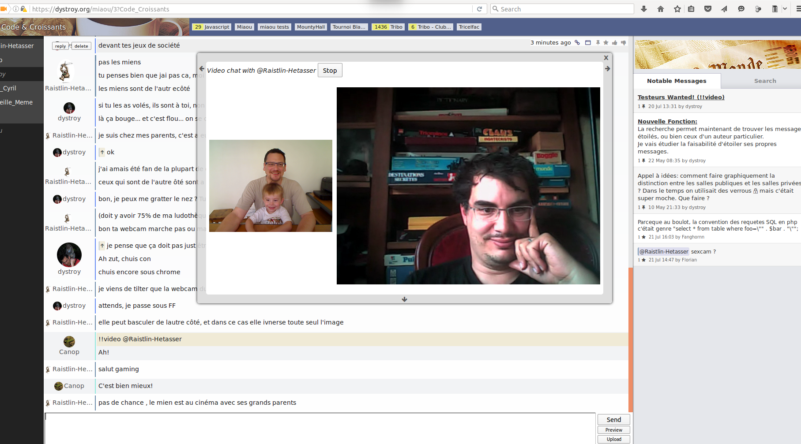

The `video` plugin lets two users have a video communication, thanks to WebRTC.

A user proposes a video conversation to another player using

    !!video @otheruser

Until users accept it by clicking the *start* button, the messages looks like this:

Once accepted, both the local camera flow and the distant one are displayed:

